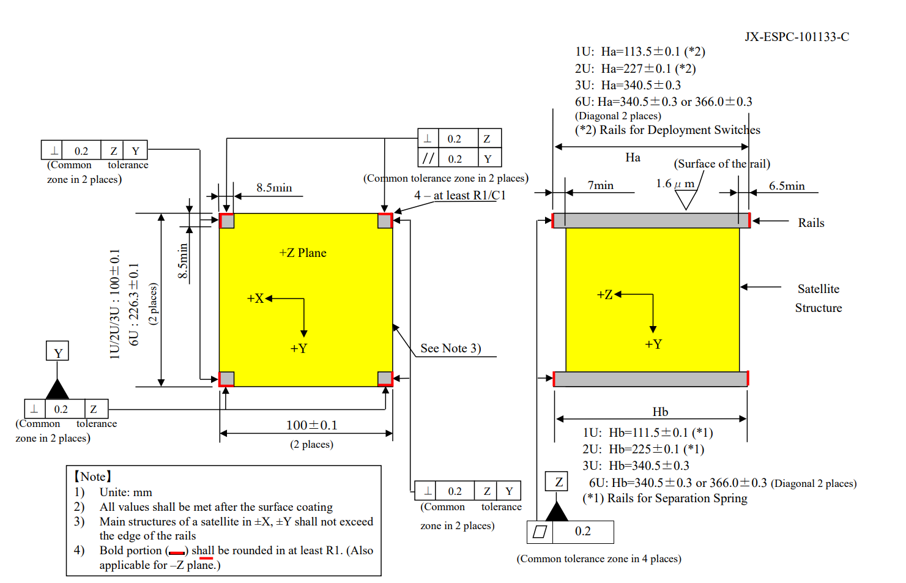
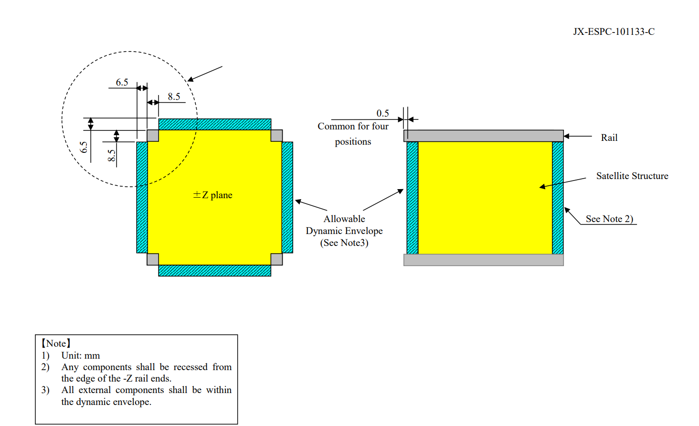
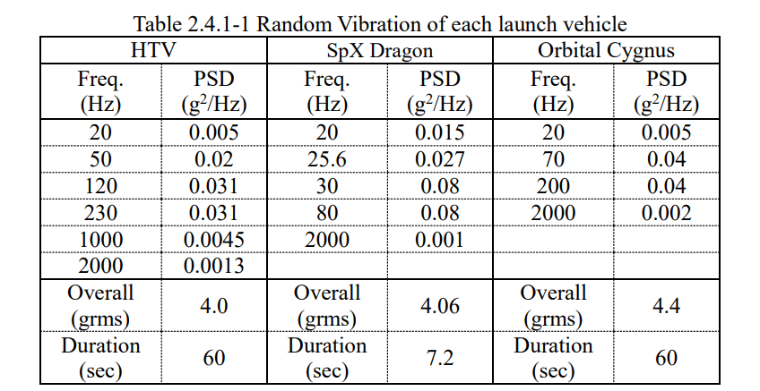

## Onboarding 4.3 Deliverable 1: Relevant JAXA Requirements
### Connor Major
This document outlines selected requirements from the JAXA cubesat specifications that are relevant to the mechanical design of a 1U cubesat structure.
Unless otherwise specified, all requirements, tables, or quotes are referenced from the [JAXA Cubesat Specifications](https://humans-in-space.jaxa.jp/kibouser/library/item/jx-espc_8e_en.pdf).

#### 2.1.1: Design Orientation
2. "+Z (+Zs) is towards the direction of the deployment. -Z (-Zs) towards the direction of the installation into the case. +Y (+Ys) towards the base-point of the case."

#### 2.1.2: Dimensional Requirements
2. A satellite shall be 100+/-0.1 mm wide in X and Y
3. For 1U type satellite, a satellite shall be 113.5+/-0.1 mm tall

##### Figure 2.1.2-1 Dimensional Requierments [sic] for Satellite

#### 2.1.3: Rails
1. A satellite shall have four rails on each corner along the Z axis to slide along the rail guides in
the Satellite Install Case of the J-SSOD during ejection into orbit.
3. The rails shall have a minimum width of 8.5 mm.
5. For 1U and 2U, chamfering should be done with R1 or C1 or more in accordance with Fig. 2.1.2-
1 for the rail edge (+/- Z standoffs). 
6. The edges of the rails on the +Z face shall have a minimum surface area of 6.5 mm × 6.5 mm for
contacting with the adjacent satellite.
7. At least 75% of the rail surfaces except for +/-Z surfaces shall be in contact with the rail guides
of the Satellite Install Case of the J-SSOD. 25% of the rails can be recessed.
For the 1U type, this means at least 85.1 mm of rail contacts with the rail guide.

#### 2.1.4: Envelope Requirements
1. The dynamic envelope of a satellite shall meet the Figure 2.1.4-1.
2. The main structure of a satellite in +Z shall be recessed more than 7.0 mm from the edge of the
rails. All components in +Z shall be recessed more than 0.5 mm from the edges of the rails.
3. The main structure of a satellite in -Z shall be recessed more than 6.5 mm from the edge of the
rails. All components in -Z shall be recessed from the edges of the rails.
4. The main structures of a satellite in +/-X and +/-Y shall not exceed the side surface of the rails.
Any components in these surfaces shall not exceed 6.5 mm normal to the side surface of the rails
including the RBF pin discussed in the section 2.2.2.

##### Figure 2.1.4-1 Allowable Dynamic Envelope

#### 2.1.5: Mass Properties
1. The satellite mass of 3 U or less shall be not less than 0.13 kg and not more than 1.33 kg per 1 U

2.1.8: Structural strength
1. A satellite shall have a sufficient structural strength with a necessary margin of safety through the
ground operation, testing, ground handling, launch and on-orbit operations. Launch environment
is defined in the section 2.4.1.
2. Each rail shall have a sufficient structural strength with considering that the rail is subject to
compression force at 46.6 N due to a preload from the Backplate and main spring of J-SSOD.

#### 2.1.9: Stiffness
1. The minimum fundamental frequency of a satellite shall be no less than 100 [Hz] on the condition
that the four rails +/-Z standoffs are rigidly fixed

#### 2.4.1. Random Vibration and Acceleration
1. Launch
    1. Quasi-static Acceleration in any direction:
        - HTV: 8.34 [g]
        - SpX Dragon: 8.67 [g]
        - Orbital Cygnus: 18.1 [g]
2. Random Vibration: When performing the vibration test on the launch environment as the verification methods of the safety design shown in Section 4.2.2, vibration environment shown in Table 2.4.1-1 shall be applied to each axis with a hard mount configuration. In addition, when performing the vibration test, the design for the unique hazard shown in
Section 4.2.2.2 shall be confirmed.

##### Table 2.4.1-1 Random Vibration of each launch vehicle

For the purposes of the later deliverables, the selected launch vehicle will be SpaceX's Dragon.

#### 2.5: Material limitations
- Rating “A” materials which are identified in MSFC-HDBK-527F (JSC-0904F) or MAPTIS2 shall
be used for a satellite.
In practice, 6065-T6 or 7071-T6 shall be used (as recommended by Dr Robert Howie)

#### 4.2.2: Standard Hazards
1. Sharp Edges / Holes
    - In order to protect crew members from sharp edges and protrusions during all crew operations, they need to be rounded or planed greater than 0.7mm to the utmost
