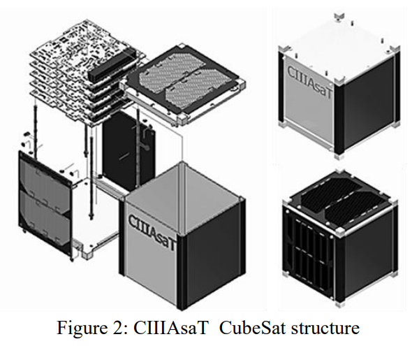
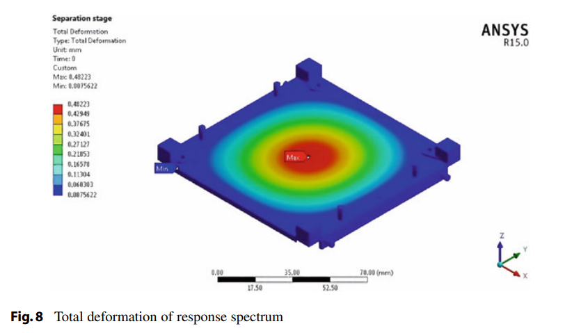
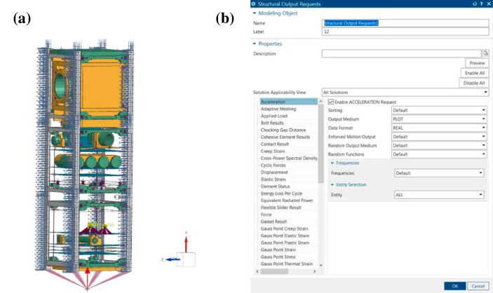
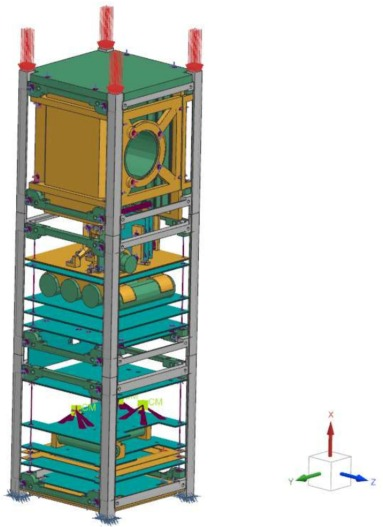
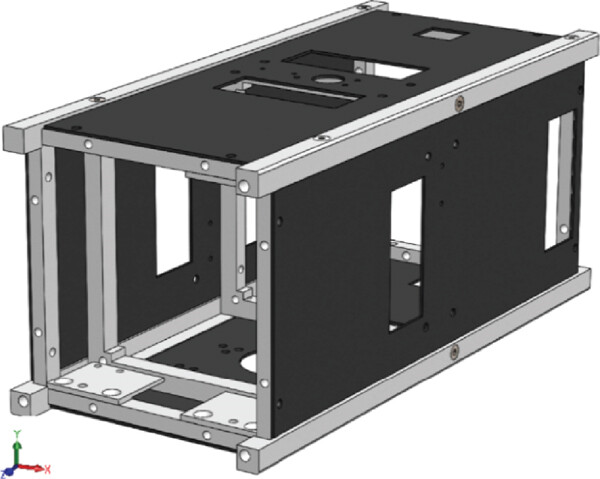
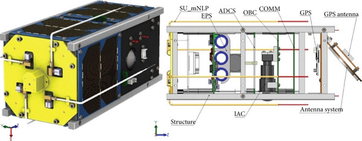

## Onboarding 4.3 Deliverable 2: Approaches to CubeSat structures
### Connor Major
This document outlines three different approaches to CubeSat structure design, by referencing in-production COTS and conceptual designs, and discusses their strengths and weaknesses.

### Summary of primary cubesat structural approaches
NASA'S [State-of-the-Art of Small Spacecraft Technology, Chapter 6](https://www.nasa.gov/smallsat-institute/sst-soa/structures-materials-and-mechanisms/) provides a broad overview of many modern approaches to cubesat design. Of particular interest is 6.2 ("Primary Structures"), which outlines three contemporary structural approaches. The full text is provided below:

### 6.2.4 CubeSat Structures Construction Methods
>#### Monocoque Construction
>Monocoque structures are load-bearing skins that have significant heritage on aircraft. On small spacecraft, the intent of this design is several-fold – it maximizes internal volume, it provides more thermal mass for heat sinks or sources, it allows for more mounting points, and it has more surface area to potentially reduce total ionizing dose (TID). Monocoque construction is common, and “extruded” designs are relatively easy to fabricate through computerized numerical control (CNC) machining, waterjet, or laser cutting.
>
> #### Modular Frame Designs
> Modular frames allow for a flexible internal design for quick-turn missions, while still ensuring strict adherence to external dimensions of the CubeSat standard, especially when deployment from a standardized, reusable dispenser is required. Open frames are suitable for low-Earth orbit, as radiation shielding is not provided by the structure. Care must also be taken to design for thermal mass requirements, as modular frames are inherently light.
>
> #### Additively Manufactured Designs
> The use of additive manufacturing allows for designs of structures that cannot be made with traditional methods or would be excessively costly to manufacture using traditional machining. Additive manufacturing process allows for much more design flexibility to customize structures to specific mission needs. Topology optimization methods, which generally create structures that are only feasible for additive manufacturing, can be used to minimize the amount of material and thus mass needed for the spacecraft structure. Some CubeSat missions have already flown using polymeric printed structures as opposed to metal which can greatly reduce both mass and cost. Considerations need to be made regarding ESD, grounding, and other possible electrical considerations to a polymeric frame. Additionally, fasteners for polymeric structures need to be evaluated differently than for metal, as plastic doesn’t create as strong of threads and heat-set inserts may not hold well to the structure in the temperature extremes of space.

### Exemplar design 1: Monocoque-style construction
The example design considered is that of CIIIAsaT
This design was outlined in 
[*CubeSat System Structural Design* (J. E. Herrera-Arroyave et. al.)](https://www.researchgate.net/publication/317209080_CubeSat_System_Structural_Design), a paper outlining a bespoke design concept with full adherence to JAXA specifications (including FEA results).

#### Figure 2, [Design 1](https://www.researchgate.net/publication/317209080_CubeSat_System_Structural_Design)

The primary differentiator here is that the skin of the cubesat carries non-negligible load, and is the primary structural component. Threaded rods are stacked internally to hold the PCB's and instruments, and the cubesat becomes a sealed box. Additive manufacturing was also used [2], with layer based printing of 6061. While some of the cubesat is additively manufactured, this component was primarily for technology demonstration, and the design itself more closely follows the NASA type monocoque construction.

#### Figure 5b, [Design 1](https://link.springer.com/chapter/10.1007/978-3-031-20675-7_6)

The skin components of the satellite bear significant load, and have significant mass. These are affixed with threaded rods and small seeger rings at the rail.

As noted in [4], one of the reasons as to the choice of this design for the mission scenario was:
> The structure in Fig. 2 has the advantage of being simple to manufacture and assemble.

### Exemplar design 2: Modular Frame design
The example design considered is the AlAinSat-1 cubesat, a 3U cubesat developed by the GRSS and NSSTC to carry multiple earth-sensing payloads [5].

#### Figure 5, [Design 2](https://www.sciencedirect.com/science/article/pii/S1110982324000528)

The view of the satellite from the FEA simulation is shown. Note the lack of load-bearing skin components, frames bolted onto a long modular design.

#### Figure 6, [Design 2](https://www.sciencedirect.com/science/article/pii/S1110982324000528)

A view of the design concept from the CAD model. The rails are the primary load bearing components for vertical loads, with a large number of struts and supports for the various payloads. Many of the struts and supports are unique shapes or complex to manufacture. While the lack of an external skin makes the components more accessible when installed, the components are difficult to install and arrange multiple times.

The design comes with significant mass benefits over the monocoque structure, but with the penalty of no radiation shielding. The additional design complexity in the components for brackets and supports, along with an increase in part counts, makes this a difficult design to manufacture, compared to flat plage monocoque. 

### Exemplar design 3 - Hybrid Frame-Skin design:
The example design considered is a Greek 2U cubesat, using a composite skin and modular frame. [6]

As outlined in [6], the key reason for the design choice is clear: 
> Results show that the new design of the structure using CFRP can offer similar levels of performance in terms of stiffness, while saving 30% of the mass, for the entire cubesat platform.

Similar to the monocoque example, the skin takes significant load, but the frame has modular supports that also take load similar to design 2, unlike the first, which has threaded rods purely to hold the internal PCB's.

#### Figure 1a, [Design 3](https://onlinelibrary.wiley.com/doi/10.1155/2018/9724263)

A view of the cubesat structure. Note the simpler design of eac frame component, as it is not fully modular, and the composite skin.

#### Figure 1b [Design 3](https://onlinelibrary.wiley.com/doi/10.1155/2018/9724263)

On the left, the fully assembled cubesat. On the right, a simplified view of the cubesat.
### Summary of designs
Material selection is primarily 6061-T6 or 7075-T6 aluminum for metals, with some choice composites (which would not be the choice for a small student team). Most designs focus on working with a simple set of load bearing members with functional structure bolted on.

### General notes about design process lessons learned
From this (and reviews of other literature about general spacecraft design, such as the New SMAD) it becomes clear that each approach to cubesat design must be evaluated against the specific mission requirements. 

To me, the engineering process (in general) consists of using domain and problem knowledge to narrow a design space. I am an advocate of the key engineering process being "recursively making hard problems into easier problems."
Much of these (especially space-relevant lessons) can be derived from Akin's Laws [3]. Some relevant ones and my interpretations are below.

Akin's 13th law [3]:
> 13. Design is based on requirements. There's no justification for designing something one bit "better" than the requirements dictate.'

The final selected design for any cubesat should be based on the specific mission requirements. In this case, a LEO imaging-type short lifespan mission, with particular attention on ease of manufacture.

Akin's 36th law [3]:
> 36. Any run-of-the-mill engineer can design something which is elegant. A good engineer designs systems to be efficient. A great engineer designs them to be effective.

The cubesat structure should do the jjob - that is, provide structural support, launcher rails and be workable. It does not need to look good or have absolutely perfect topography - in space, things have to work as the #1 priority.

Akin's 38th law [3]:
> 38. Capabilities drive requirements, regardless of what the systems engineering textbooks say.

The capabilities and resources of a student cubesat team will drive the requirements of the conceptual design - manufacturing capabilities in particular w.r.t processes and material selection. 

Akin's 39th law [3]:
> 39. Any exploration program which "just happens" to include a new launch vehicle is, de facto, a launch vehicle program.

Similar to the concept of "innovation tokens", any design should attempt to minimize the number of novel or wholly new design components to avoid design complexity. While PAST is focused on learning, real engineering learning can be done without having to make a wholly novel design (as is the case in all engineering units.)

Furthermore, some sentences in design documents were particularly illuminating:
>When selecting these parts, the following must be considered: (1) structure type; (2) materials; (3) geometry; (4) stiffness and fatigue resistance; (5) joints; (6) payload access; (7) load distribution; (8) preload; (9) disassembly. [[4]](https://link.springer.com/chapter/10.1007/978-3-031-20675-7_6)

### References
Forgive me for not formatting a reference list to full IEEE standard this time.

[1] [*CubeSat System Structural Design* (J. E. Herrera-Arroyave et. al.)](https://www.researchgate.net/publication/317209080_CubeSat_System_Structural_Design)

[2] [*CIIIASaT Structure Additive
Manufacturing Design* (M. Ley-Bun-Leal et. al.)](https://doi.org/10.1007/978-3-030-38912-3_4)

[3] [*Akin's Laws of
Spacecraft Design*](https://spacecraft.ssl.umd.edu/akins_laws.html)

[4] [*Dynamic Computational Analysis of a Cubesat Structure to Test a New Material for a Space-Radiation Protection Shield*](https://link.springer.com/chapter/10.1007/978-3-031-20675-7_6)

[5] [*Structural Analysis of AlAinSat-1 CubeSat*](https://www.sciencedirect.com/science/article/pii/S1110982324000528)

[6] [*Design, Analysis, Optimization, Manufacturing, and Testing of a 2U Cubesat*](https://onlinelibrary.wiley.com/doi/10.1155/2018/9724263)