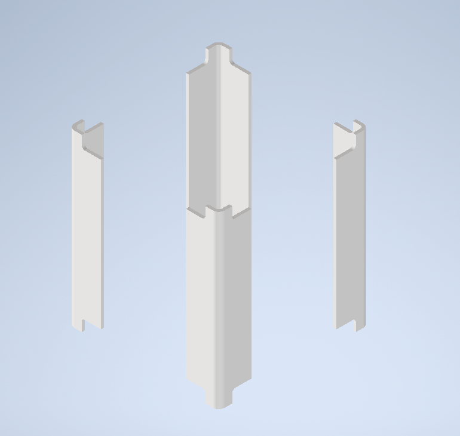
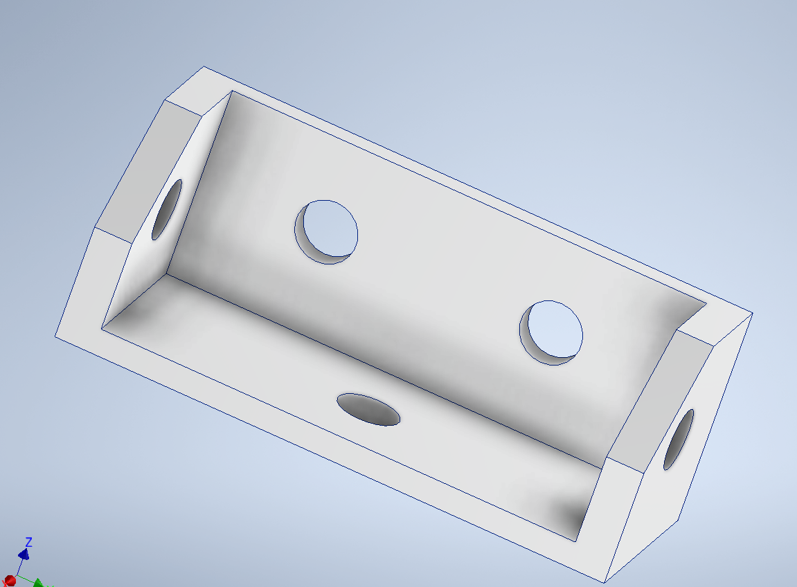

## Onboarding 4.3 Deliverable 3: Concept Design Outlines
### Connor Major

This document outlines three basic concept designs for a Cubesat structure that meet JAXA requirements. The concepts are not fully annotated as they are only rough drafts

## 1 - Bent Metal Stack
- https://youtu.be/g3cu0GTfYDk
- https://youtu.be/mJD_obo5iS8

This design uses a full stack of PCB's enclosed by a bent-metal frame. Instead of using a single square element at the corners, the design would use a bent-metal corner, with tabs added to achieve the connection points at the corners in the reference design.

PCB's and sensors would be inserted on threaded inserts in 

This design requires bending of metal and precision threading of rods. While the number of threaded connections is low, the precision of these required is high and would be difficult to loctite, and is not flexible with respect to hardware. However, the overall part and connection count is low, and could be low in mass with minimal machining. 

Structurally, the lack of significant bending resistance in the horizontal planes is concerning, allowing twisting and torsion of the design under loading, which may damage PCB's or lead to high impact vibration.

## 2 - Bolt-On-Rails
- based off https://youtu.be/vIhSw_3WwuI

This design would screw the PCB's onto their own metal frames. This would be a square with externally protruding corners to meet rail dimensions, with rectangular prisms extending vertically from the sides as in the reference design. Each PCB would be stacked as per previous designs. The PCB frames would be a structural element, with the PCB's seperated by an o-ring to avoid buckling or load. The primary idea was to reduce all external structure as much as possible, with only rails.

The design is overall a stack of PCB's connected via threaded standoffs, with frames bolted onto the stack.

Unfortunately, external structure is useful, and mounting tabs would be required, as with other designs. However, a primary concern is the rails. The JAXA rail area requirements mean a significant assembly needs to be bolted onto the PCB stack, which requires complex connections. The significant area means a large amount of mass is non-structural, and while this may mean the rails could be thinner to increase PCB size, the non-structural mass and volume is wasteful, and the fastener requirements make this design not significantly space saving. Further, the threaded connections would be difficult in practice to assemble and dissasemble. 

Further, the need for significant structural elements to resist bending and torsion inside the satellite chews up volume further, and would make for significant mounting constraints and cramp payloads. Further, the requirement for threaded standoffs of specific heights may be difficult to procure or require modification of spec parts, both difficult and risky.

However, the design means the primary payloads can be assembled on one stack without rails in the way, and have external elements bolted on at will, making partial assembly significantly faster.  

The O rings to reduce vibration and isolate the PCB's from structural load are another part that requires QC and would be difficult to procure due to tight materials requirements

## 3 - Recessed Rails

This design uses hard machined rails with recessed holes to bolt hardware onto. This design uses a modular bolt on to each corner with both top and bottom mounting holes for PCB frames (made of flat 6061 plate) that resist compression and bending, as well as horizontal bars that resist translation in horizontal axes. This design was made with high mechanical properties in mind, with the idea to leverage external manufacturing for one complex component. 

 
A small bracket to mount the stacked on components to the rails provides flexibility in design - six internal stacks. 

This design uses a large number of machined parts, including parts that have multiple if not all machined faces. This requires external manufacture and will be both expensive and a choke point. This design also has complex FEA requirements due to complicated features and a large number of connections and components. It also has the possiblity to have severe mass creep due to the sheer number of components, as well as pinch points or difficult threads during assembly. The number of components and threads makes assembly difficult, although not all components or threaded mounts are required for initial verification of physical arrangement.

While this design is very fixed internally compared to the threaded rod arrangements, the external bars allow for a wide range of external mounts.

## Selection methods

Each design is intended to fit the JAXA requirements. However, some other requirements or goals were imposed by the design document.The design needed to be manufacturable. It needed to be disassembled, reassembled, leverage COTS parts where possible, and provide mounting for other, non PCB parts. It also needed to be modular and allow for later design changes. It also needed to be simpler than the current design to justify being worked on.

I ranked these criteria, before assessing my designs:
1. Must be manufacturable (to be achieved at all)
2. Must function in a space environment 
3. Must meet JAXA specifications
4. Must be simpler than current design (to justify engineering effort)
5. Must be capable of disassembly/reassembly
6. Must leverage COTS parts
7. Must provide mounting for other parts
8. Must limit fasteners
9. Must be modular

I ended up selecting design 3. It had the easiest method of manufacture, as it allows the use of external manufacture for the primary load component (rails) while other . As it didn't required CNC work, it was simpler than the current design. It did use a large number of bolted connections, which would slow disassembly. However, while the increase in bolted connections is significant, not all connections are required. The high number of connections ensures structural properties, but one or two points of contact of the three per rail/frame contact are required, and not all PCB screws are required. This allows for a low-security physical clearance check that uses a minimal number of screws, while other designs had no redundant screws. This also increases confidence in function - while there is a mass increase, the screws can be smaller (as they carry less load) and also can fail with the design still operating.

It used the same level of COTS parts as previous designs, but the flat metal sheets allowed for laser or water cutting in-house to spec, which also meets modularity requirements.

Overall, design 3 provides the highest level of confidence in key areas, and will be analysed further